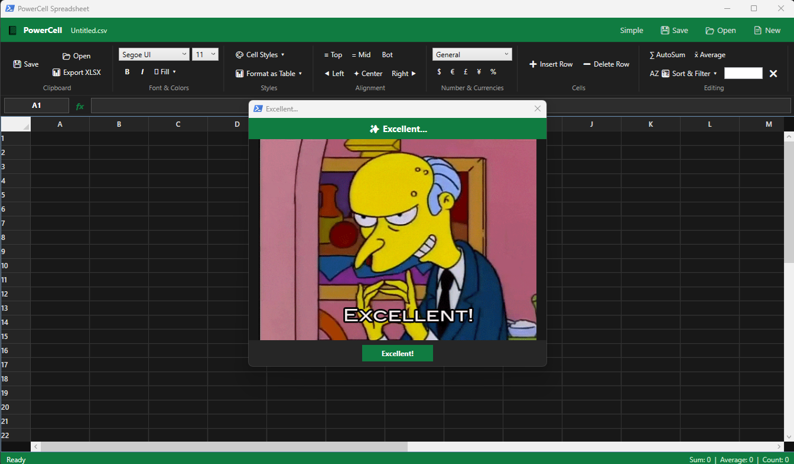

# PowerCell📊

> **PowerCell** is a high-performance, lightweight, single-file PowerShell application that delivers an authentic **Microsoft Excel GUI experience** to any Windows environment—without requiring Microsoft Office!



---

## 🌟 Key Features

- **Streamlined Office Dark Theme Ribbon**: Authentically styled Office dark ribbon organized into logical section cards (*Clipboard*, *Font*, *Alignment*, *Number & Currencies*, *Cells*, *Editing*).
- **Multi-Currency Formatting**: Instant currency selection for **USD (`$`)**, **EUR (`€`)**, **GBP (`£`)**, and **JPY (`¥`)**, plus **Percentage (`%`)**.
- **Text Positioning & Alignment**: Full horizontal (**Left**, **Center**, **Right**) and vertical (**Top**, **Middle**, **Bottom**) cell text alignment.
- **Multi-Cell Range Selection**: Click & drag, `Shift`+Click, or `Ctrl`+Click to select ranges (e.g. `B2:D10`).
- **Live Range Aggregates**: Real-time calculation of **Sum**, **Average**, and **Count** across selected multi-cell ranges displayed in the green Office Status Bar.
- **60 FPS UI Virtualization**: High-performance WPF row and column virtualization (`VirtualizationMode="Recycling"`) for smooth scrolling and instant sub-millisecond cell rendering.
- **Font & Style Controls**: Toggle **Bold** (`B`), *Italic* (`I`), **Underline**, and alternating **Zebra Table Styles**.
- **Column Sorting & Live Filtering**:
  - **Sort Ascending (A ➔ Z)**: Sort rows dynamically by selected column.
  - **Sort Descending (Z ➔ A)**: Sort rows descending by selected column.
  - **Live Filter**: Instant search row filtering across the entire dataset.
- **Reactive Formula Engine**: Dynamic formula recalculation starting with `=`, supporting:
  - Aggregates: `=SUM(A1:A10)`, `=AVG(B1:B10)`, `=COUNT(C1:C10)`, `=MIN(...)`, `=MAX(...)`.
  - Expressions: `=A1 + B2 * 1.5`, `=(C1 - C2) / 10`.
- **Multi-Format Support**: Directly open, edit, and save `.csv`, `.tsv`, and `.xlsx` files.
- **Single-File Distribution**: Portable script in `PowerCell.ps1` with zero external dependencies. Double-click `powercell.cmd` to run immediately!

---

## 🚀 Quick Start

### Prerequisites
- **Windows 10 / 11** or **Windows Server**
- **PowerShell 5.1+** or **PowerShell 7+**

### Running PowerCell

```powershell
# Navigate to directory
cd C:\dev\PowerCell

# Launch PowerCell with a blank sheet
.\PowerCell.ps1

# Or double-click the batch shortcut
.\powercell.cmd

# Open a CSV or Excel file directly
.\PowerCell.ps1 sample_data.csv
```

---

## 🛠️ Usage & Controls

| Feature | Ribbon Group | Description |
| :--- | :--- | :--- |
| **Edit Cell** | Double-Click cell or select & edit in Formula Bar | Updates raw value or formula |
| **Commit Formula** | Press `Enter` in Formula Bar or Cell | Triggers live formula evaluation across grid |
| **Save File** | `💾 Save (Ctrl+S)` or Quick Access Bar | Saves changes to CSV / XLSX |
| **Open File** | `📂 Open File` | Load CSV, TSV, or XLSX spreadsheets |
| **Insert Row** | `➕ Add Row` | Inserts a new row at selected cursor position |
| **Delete Row** | `➖ Delete Row` | Deletes row at selected cursor position |
| **Insert Column** | `➕ Add Column` | Adds a new column |
| **AutoSum** | `∑ AutoSum` | Automatically generates `=SUM(col1:colN)` |
| **AutoAverage** | `x̄ Average` | Automatically generates `=AVG(col1:colN)` |

---

## 📁 Repository Structure

```
PowerCell/
├── PowerCell.ps1     # 100% Standalone Single-File Application
├── screenshot.png    # GUI Screenshot
```

---

## 🧪 Testing

Run the included unit tests to verify formula evaluation and format conversion:

```powershell
powershell -ExecutionPolicy Bypass -File .\tests\TestEngine.ps1
powershell -ExecutionPolicy Bypass -File .\tests\TestFormats.ps1
```

---

## 📄 License

Distributed under the [MIT License](LICENSE). Free for personal and commercial use.
